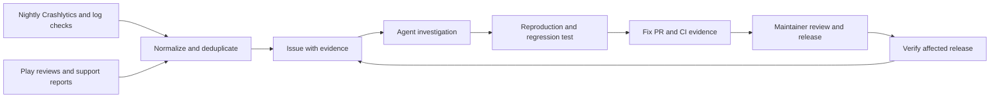

# AI friendly development and reliability plan

**Status: implementation in progress (October 2, 2026). Android and native iOS
verification pilots are implemented; service activation and full feature coverage
remain open.**

This plan describes how Melon can give coding agents enough context, reproducible
app states, and verification tools to make changes with confidence. It also
connects production failures and user feedback to an actionable development
backlog. The goal is to make each merge come with evidence that important behavior
still works, then verify that evidence against the released app.

The repository-local implementation described below is now underway. It does not
activate production integrations, schedules, repository protection, public issue
posting, customer replies, merging or releases. The agreed direction remains
Android first, with a nightly Firebase issue check as the initial monitoring
approach. The maintainer can provide a Google Play service account for review
access. Credentials and operational policies remain separate setup work.

## Implementation ledger

The commands and current limits live in [testing](testing.md),
[scenarios](scenarios.md), [screen coverage inventory](scenario-coverage.md), [API contracts](api-contracts.md),
[native iOS testing](ios-testing.md), [performance](android-performance.md),
[observability](observability.md) and [release recovery](release-recovery.md).
The historical inspection and proposed milestones below are retained as the
backlog, not a claim that every item is finished.

| Area | Repository-local implementation | Remaining evidence or setup |
| --- | --- | --- |
| Merge verification | Always-running dispatcher and stable required result; builds, unit/JVM tests, lint, landing checks, test artifacts and issue/PR templates. | Enable the required check in repository protection after a remote workflow run. |
| Mechanical rules | Tested Kotlin convention lexer with an explicit existing-debt baseline; fixture provenance and credential-pattern checks. | Compiler-aware lint, removal of existing convention debt, hosting-provider/history secret scanning. |
| Android scenarios | Hermetic synthetic login/sync/Home/empty messages, resettable failures, fixed projection clock, isolated app, real device journeys and evidence gallery. | Extend the catalog to remaining screens, flag combinations and device/permission configurations. |
| Rendering | Home state/callback rendering, light/default and dark/large-text accessibility checks, deterministic Compose captures and an explicit screenshot comparison command. | Review and establish device-specific visual baselines; broaden accessibility coverage and manual assistive-technology review. |
| Behavioral coverage | Shared Kotlin/Swift wire decoding, backend serializer verification, Home time/attendance boundaries and initial-sync failure/retry regression coverage. | Remaining enrollment, grade-calculation and full feature integration cases from milestone 3. |
| Performance | Physical-device Macrobenchmark and profile-generation suites passed; isolated release-like app and manual physical-device workflow. | Review generated rules before shipping, choose a consistent measurement device, establish repeatability and trend thresholds. |
| Native iOS | Synthetic TCA/HTTP/GRDB pilot, full package lane, explicit intent/UI target, screenshots/hierarchies and accessibility checks. | Three out-of-process AppIntents tests require a runtime that supports Apple's internal execution APIs; full visual/device coverage remains open. |
| Private repair tooling | In `unes-backrooms`: bounded Crashlytics queries, Play reviews/vitals adapters, durable draft queue, normalized log input, allowlisted GitHub digest/outcome metrics, request correlation and provider tests. | Real service identities, export/store access, schedule/host configuration, diagnostics policy and publishing policy; no live incident or release verification yet. |

The Android pilot found and fixed an initial-sync failure path that could wait
indefinitely or mark failed work complete. Failures now offer retry and only
successful work advances. The device journey verifies failure → retry → Home.
Native package verification executed 424 passing tests; the explicit UI/intent
lane executed five passing tests with three narrowly reported platform-runtime
skips. Local evidence is under ignored `artifacts/`; local runs identify a dirty
worktree rather than claiming the changes exist in the recorded HEAD commit.

Final local validation: `bun run android:check` passed release packaging,
69 Android/KMP tests, benchmark test-APK compilation and lint. All seven Android
pilot entry points ran on the connected Pixel 9 Pro XL; the final sync retry and
two rendering/accessibility checks were rerun after review fixes. The physical
benchmark and profile suites each passed two tests. Repository tooling passed
24 tests plus formatting, convention and fixture checks; landing typecheck/build
passed. The private backend passed 34 tests, type checking and formatting/lint.
These are local results, not a claim that the newly written CI workflows have
already run remotely or that production integrations are active.

## Current foundations

Repository inspection on October 2, 2026 found the following. These are source
observations, not test execution results or measurements of coverage.

| Area | Current state | Main opportunity |
| --- | --- | --- |
| Android and KMP tests | Five Android app unit test files and four KMP test files cover areas including push synchronization, reminders, reviews, updates, deep links, authentication, and database migration. | Expand feature behavior and integration coverage. |
| Android CI | [The workflow](../.github/workflows/android.yml) assembles release, runs `testDebugUnitTest` and `jvmTest`, and runs Android lint. It uploads lint reports. | Add device tests, visual evidence, test reports, and reliable merge gates. |
| iOS tests and CI | There are 48 files under `UNESKit/Tests`. [CI](../.github/workflows/ios.yml) builds the app and runs UNESKit tests on an iOS simulator. A separate `UNESIntentTests` target exists in the app scheme, outside that package test command. | Run the intent tests explicitly and add UI journeys and visual checks. |
| UI test infrastructure | No Android instrumentation test sources or Compose test dependencies, iOS UI test target, or screenshot test suite were found in the inspected configuration. | Establish one repeatable path for agents to launch and inspect app scenarios. |
| Fixtures and state | Both platforms already have fixtures. iOS uses TCA dependency overrides and test clocks. Android has explicit state and injected dependencies, but some screens acquire their ViewModel internally. | Turn these foundations into a shared scenario convention. |
| Local mock server | `scripts/mock-melon.ts` serves enrollment and campus-event fixtures and exposes `/debug/*` toggles for session expiry, token refresh, credential status, and reauthentication. Every unmocked route is proxied to production. | Make it the scenario backend for agents and CI, with a mode that rejects unmocked routes. |
| Convention enforcement | The Android color, typography, string resource, and visibility rules in `CLAUDE.md` are enforced by review only. No custom lint rules or architecture tests were found. | Move mechanical rules into checks that fail the build. |
| Performance and accessibility | No Macrobenchmark, Baseline Profile, or automated accessibility check configuration was found. | Measure startup and add accessibility checks to rendered scenarios. |
| Production signals | Android and iOS initialize Crashlytics. KMP and native iOS ship remote logs through `/api/logs`. Both apps use PostHog and the existing remote settings system. | Improve correlation and turn signals into deduplicated work. |
| Landing site | Bun scripts provide formatting, linting, Astro type checking, and builds. Only Android and iOS workflows were found. | Add a small site check lane after the mobile foundation. |

The backend is a separate, closed-source service. Native iOS does not consume KMP.
Backend contracts, telemetry ingestion, and automation infrastructure therefore
need explicit ownership across repositories. `apps/ios/README.md` and comments in
KMP's `ClassAllocationEntity`, `ObserveScheduleWeekUseCase`, and
`PasskeyRepository` still mention the former `apps/api` layout; correcting stale
architecture guidance is part of making the repository easier for agents to
navigate.

## 1 Make tests prove behavior

Agents should add substantial coverage, with priority based on the cost of a
failure. Test count and line coverage are useful inventory measures, but neither
establishes that a change is correct.

The proposed contribution rule is: every behavior change identifies the behavior
at risk and supplies the smallest useful set of tests that protects it.
Documentation and mechanical changes do not need artificial tests just to satisfy
a quota.

For bug fixes, the agreed expectation is a regression test that reproduces the
failure before the fix and passes afterward, where practical. Confirm that the
initial failure demonstrates the reported bug rather than a broken test setup.
Keep the test in the relevant CI suite and include the reproduction command and
before-and-after results in the PR. If automated reproduction is not feasible,
document the specific limitation, the verification performed, and the remaining
coverage gap. Turn production incidents into synthetic fixtures or named scenarios
when needed so future agents can reproduce them without production access.

| Test layer | What to protect | Execution |
| --- | --- | --- |
| Unit and state transitions | Calculations, validation, reducers, ViewModels, cancellation, retries, and navigation decisions. | Every relevant PR; deterministic time and dependencies. |
| Integration and contracts | HTTP decoding, token rotation, repository behavior, real local database transactions, and migrations. | Every relevant PR using local fixtures and temporary databases. |
| Screen behavior and screenshots | Visible states, enabled actions, semantics, accessibility, and unintended visual changes. | Changed features on PRs; full catalog on a scheduled run. |
| Instrumentation and UI journeys | App startup, dependency wiring, navigation, persistence, lifecycle, permissions, and system integration. | A small required emulator suite; wider device coverage later. |
| Release verification | Minification, packaging, cold launch, upgrade behavior, and critical journeys in a release-like build. | Before release, followed by rollout monitoring. |
| Performance | Cold start time, frame timing on heavy screens, and the effect of Baseline Profiles. | Scheduled on a consistent device; sustained regressions become tickets. |

Start Android coverage with login and token refresh, initial sync, cached data while
offline, session expiration, grades and attendance calculations, enrollment
validation, and notification navigation. Enrollment deserves special attention:
submitting replaces the complete proposal, and the client enforces hours,
conflicts, and deadlines. Use synthetic responses for this flow; ordinary tests
must never submit a real student's enrollment.

Fast startup is a product goal (section 8) but is not measured today. Add a
Macrobenchmark module that records cold start and frame timing for Home and the
heaviest lists, and generate Baseline Profiles from the same journeys. Run it on
a scheduled lane with a consistent device, since emulator timing is too noisy
for PR gates, and route sustained regressions to the repair queue.

Tests should assert independently understood outcomes. An agent copying the
implementation into the expected result can produce a passing test that preserves
the same bug. Use explicit examples from the feature contract, boundary cases,
and invariants such as a refresh occurring only once for concurrent callers.
Property tests can exercise many valid inputs; selective mutation testing can
later check whether critical tests detect intentionally broken behavior.

Because the backend is separate, agree on versioned, synthetic API examples or a
schema with its repository. Both KMP and Swift should decode the same relevant
examples. Client fixtures alone cannot prove the server still honors a contract;
provider verification belongs in the backend pipeline. Real staging checks should
be a separate lane with an isolated test account and explicit cleanup.

## 2 Make every screen reproducible

Build a scenario catalog that developers, previews, tests, and agents can all use.
A synthetic account provides coherent data across screens; named scenarios add
the variations an account alone cannot reproduce, such as a stalled request,
expired session, denied permission, or failed refresh.

Each screen should declare its meaningful states and transitions. Typical states
are loading, empty, populated, stale, offline, recoverable error, expired session,
permission denied, and feature unavailable. Include feature-specific cases such
as an ongoing class, semester rollover, or an enrollment conflict. Mark states
that do not apply instead of inventing them for every screen.

Suggested scenario records contain a stable ID, feature and route, fixture version,
synthetic account, initial storage, fixed time and timezone, feature flags,
dependency responses, supported actions, and expected visible outcomes. For
example:

| Scenario | Setup | Expected behavior |
| --- | --- | --- |
| `home.offline-with-cache` | A saved semester, fixed clock, failed refresh. | Cached content stays usable and refresh status is truthful. |
| `auth.session-expired` | Expired credentials and a rejected refresh. | The app offers sign-in without losing the intended destination. |
| `enrollment.schedule-conflict` | Synthetic sections with overlapping times. | Submission is blocked and the conflict is explained. |
| `messages.empty` | Successful response with no messages. | The empty state appears without an error. |

The catalog should support three entry points: render a screen from state, run its
real state logic against controlled dependencies, and launch the installed app
into a scenario. These prove different things. A screenshot of injected state
does not prove that the real app can reach or recover from that state.

Start the third entry point from the existing local mock server,
`scripts/mock-melon.ts`. It already serves enrollment fixtures, including a
schedule clash, unmet prerequisites, and a waitlist, and it switches session
expiry, token refresh, credential status, and reauthentication behavior through
`/debug/*` endpoints. Several scenarios above already exist there as toggles.
Three gaps keep it from being a scenario backend today:

- It proxies every unmocked route to the production API, so sign-in and sync
  need a real account. Add a hermetic mode that serves the synthetic account and
  rejects unmocked routes, use it in CI and agent runs, and keep proxying as an
  explicit opt-in for manual testing.
- Its state is process-global and `/debug/reset` only reopens the enrollment
  window. Scenarios need one reset that restores every toggle.
- Fixture dates are computed from the current time. Allow a pinned clock so a
  scenario renders the same way on every run.

Agents also need a scripted way to run a scenario and observe the result.
Document one loop per platform: build a debug app against the mock server,
install it, forward the port with `adb reverse`, open the target screen, then
capture a screenshot, the view hierarchy, and logcat filtered to the app. iOS
uses `simctl` for the same steps. The `unes://` deep links in
`docs/deeplinks.md` already reach the main tabs; scenarios that need more setup
than a destination require a debug-only entry point. Package the loop as a
project skill or command (section 9) so an agent can check a UI change on a
running app instead of stopping at passing unit tests.

For Android, separate dependency and lifecycle wiring from rendering where
needed. For example, `OverviewScreen` currently obtains its ViewModel through
`hiltViewModel()`, while `OverviewUiState` and its ticker use the system clock.
A state-and-callback content function plus an injectable clock would make this
screen easier to exercise. Reuse the existing architecture rather than rewrite
features around a new test framework.

Use native Compose test APIs for behavior and semantics. They support finding
elements, assertions, actions, and controlled time. Choose a screenshot runner
through a small compatibility trial with the repository's Gradle, Kotlin, and
Compose versions before standardizing it. [Compose testing documentation](https://developer.android.com/develop/ui/compose/testing)

Fixture execution should control clocks, UUIDs, random seeds, dispatchers, locale,
timezone, images, database contents, permissions, and remote settings. Unknown
network requests should fail the test. Analytics, remote logging, push registration,
and store prompts should use test implementations. A fresh scenario must not
inherit credentials or cached state from a previous run.

Keep fixture selectors and authentication shortcuts in test or dedicated internal
builds. They must be unavailable in production. The existing Android API base URL
override is useful for local server tests, but does not by itself provide this
isolation. Also account for Android's current debug behavior that enables feature
gates: tests need to exercise both enabled and disabled production behavior.

Fixtures will often be derived from production incidents, and the repository is
public. Fixtures may contain only synthetic people and records: no real names,
enrollment numbers, CPF numbers, email addresses, tokens, or message contents.
Add a scrubbing step to the path from incident to fixture, and run secret
scanning plus a check for real-looking identifiers in CI. Such checks catch
mistakes but cannot prove data is synthetic, so record each fixture's origin
alongside it.

Cover every declared meaningful state, and test important transitions such as
loading to failure to retry to success. Use representative combinations of dark
mode, large text, screen sizes, OS versions, and flags. Exhaustive combinations
are appropriate for small decision tables; use pairwise combinations and extra
cases for known risky interactions when the matrix becomes large.

Run automated accessibility checks on each rendered scenario. Compose UI tests
can enable the Accessibility Test Framework checks, which report problems such
as small touch targets, low contrast, and missing labels; XCUITest offers
`performAccessibilityAudit()` for the iOS phase. These checks complement, but do
not replace, TalkBack, VoiceOver, and large-text review of critical journeys.

CI should publish an HTML scenario gallery and screenshot differences, including
the scenario ID, commit, device configuration, and reproduction command. Agents
can inspect these artifacts and run one scenario without knowing a real password.
Snapshot updates should explain intended visual changes; automatic acceptance of
every new baseline defeats the check.

## 3 Make CI the merge contract

Provide documented commands that work locally and in CI, with machine-readable
results and understandable failure messages. A future task interface could expose
Android unit, screen, smoke, and single-scenario runs. Define and verify those
commands during implementation; this document does not introduce them.

Keep the fast PR suite focused and dependable. Add an always-running workflow
entry point that determines affected platforms and reports one stable required
result. This avoids making a path-filtered workflow an indefinitely pending
required check. Shared build configuration changes should select every affected
lane. Confirm actual repository rules and runner availability during setup;
source inspection cannot establish whether branch protection is enabled today.

The proposed evidence for a merge is:

- Relevant builds, lint, unit tests, integration tests, and smoke journeys pass.
- Changed behavior has regression or scenario coverage, or a specific explanation
  of the remaining gap.
- Intentional screenshot changes are reviewed alongside behavioral assertions.
- Convention checks, secret scanning, and fixture checks pass.
- Test reports, screenshots, and failure logs are attached to the run.
- A reviewer can see what ran, what was skipped, and how to reproduce failures.

Measure duration and flaky failures before setting performance targets. Record
first-attempt failures even if a diagnostic rerun passes. Quarantined tests need an
issue, an owner, and an expiry; quarantining a critical journey must leave the
coverage gap visible. Raise coverage expectations gradually around changed and
high-risk code instead of imposing an arbitrary repository-wide percentage.

Retain Linux Android and KMP verification without pulling iOS targets into the
required Gradle lane. Keep both KMP targets configured. Continue the existing
native iOS macOS validation, then expand it during the iOS phase.

## 4 Turn Crashlytics issues into a repair queue

Start with GitHub Issues and a GitHub Project. This keeps work beside the code and
avoids making a new Linear account a prerequisite. Projects can organize issues
and PRs across repositories; Linear can replace the board later if its workflow
is preferable. [GitHub Projects documentation](https://docs.github.com/en/issues/planning-and-tracking-with-projects/learning-about-projects/about-projects)

The proposed processing flow is:

Start with one nightly job. A scheduled GitHub Actions workflow in a private
operations repository is a reasonable first host. Set its intended local time
explicitly using `America/Bahia`, with the scheduler's timezone behavior accounted
for during implementation. The nightly run should collect evidence and prepare
work; launching a repair for every finding can be a later step.

The concrete CLI route is Crashlytics export to BigQuery, followed by an
authenticated `bq query` against the exported data. Google Cloud CLI tooling can
handle authentication and setup; this plan does not assume there is a generic
`gcloud` command that lists Crashlytics issues. Exported events contain `issue_id`,
which supports grouping and ticket deduplication. [BigQuery CLI](https://docs.cloud.google.com/bigquery/docs/quickstarts/load-data-bq),
[Crashlytics export schema](https://firebase.google.com/docs/crashlytics/bigquery-dataset-schema)

The proposed nightly job should:

1. Check export freshness and record the last successful run separately from the
   newest available event. Report stale or unavailable data explicitly.
2. Query a bounded, overlapping lookback window and compare discovered issue IDs
   against persistent history. Revisit older windows periodically to catch late
   events, and resume from persisted progress after missed runs.
3. Group fatal, non-fatal, and ANR events where present. Create or update tickets
   keyed by Firebase project, app, and issue ID; update counts without duplicating
   tickets or comments on reruns.
4. Summarize affected releases, impact, device cohorts, and sanitized diagnostic
   samples. Highlight new issues, worsening impact, and recurrence on a supposedly
   fixed version for investigation.
5. Publish one digest with new work, updated issues, unresolved evidence gaps,
   and the health of the monitoring job itself.

Bootstrap history from the available export and record its coverage window.
An issue first seen by this worker is not necessarily newly created in Firebase.
Exported occurrence data is also not an authoritative feed of console status
changes such as manual closure. Keep those distinctions in ticket wording.

Default batch export runs daily with variable timing, and its initial export can
take up to 48 hours. A nightly scan can therefore miss events until a later run;
it must not assume the previous day's export is complete. Streaming is optional
and has separate eligibility and cost considerations. Use bounded queries and
query cost limits. [Crashlytics BigQuery export](https://firebase.google.com/docs/crashlytics/bigquery-export)

Crashlytics is not the only stability signal that matters. Google Play computes
its own Android vitals, including user-perceived crash and ANR rates and slow
cold starts, and applies bad-behavior thresholds that can reduce the app's store
visibility. The Play Developer Reporting API exposes these metrics and detected
anomalies. The nightly job can read them through the Play identity from section
5, given read access to app quality data, and add them to the digest. Vitals and
Crashlytics count differently, so report each against its own denominator
instead of merging the numbers.
[Play Developer Reporting API](https://developers.google.com/play/developer/reporting)

Add event-driven alerts later if critical failures need faster attention. Cloud
Functions can receive Firebase alert events, including new fatal issue alerts.
Those events should feed the same ticket keys as the nightly scan so both paths
converge on one issue. [Firebase alert triggers](https://firebase.google.com/docs/functions/alert-events)

Every actionable ticket should record:

- Source ID and link, platform, affected versions, first and last occurrence.
- Impact counts, their time window, and a denominator where available.
- Sanitized stack or error signature, relevant OS and device cohorts, and flag state.
- Candidate code paths and correlations, explicitly separated from established facts.
- Reproduction status, a fixture or scenario when available, and acceptance criteria.
- Fix PR, first released version containing it, and post-release verification status.

Route backend failures to the backend backlog rather than inventing client fixes.
Missing reproduction or diagnostic data should produce a precise investigation
task. A merged PR means a fix is prepared; it does not establish that affected
users have received it. Track released and verified separately, and compare
occurrences on fixed versions rather than waiting for old installations to stop
reporting the issue.

Melon is public, so raw production diagnostics belong in a private operations
repository or restricted store. Public code issues should contain sanitized
reproductions. Making a Project private does not make issues in a public
repository private. The monitoring worker belongs in the backend or an operations
project; app binaries must never contain its ticketing credentials.

Give this worker a dedicated service account with access to the relevant dataset
and permission to run queries, without release-management privileges. For GitHub
Actions, prefer Workload Identity Federation and short-lived credentials tied to
the trusted repository and workflow. Keep the Play identity separate so review
access and diagnostic access can be changed independently.
[Google Cloud workload authentication](https://docs.cloud.google.com/iam/docs/workload-identity-federation-with-deployment-pipelines)

## 5 Connect Play reviews to likely problems and useful replies

Use the Google Play service account the maintainer can provide. Enable the Play
Developer API and grant that account the required app access in Play Console;
Cloud IAM access alone does not establish Play Console permissions.
[Play API service account setup](https://developers.google.com/android-publisher/getting_started)

Google documents the `Reply to reviews` permission for this API, including its
review access workflow. Scope it to the app and omit unrelated release and
financial permissions. The initial agent tool should expose retrieval and draft
generation only; API permission to reply does not require enabling automatic
publication. Keep credentials in the runner's managed secret or identity system,
outside the repository and model context.
[Review API authorization](https://developers.google.com/android-publisher/reply-to-reviews)

The Play Developer API exposes review text and optional device, Android version,
and app version metadata. These fields can narrow candidate incidents. They do
not provide Melon's account or installation ID, so matching a device model is not
proof that a particular account wrote the review. Review time is also not
necessarily failure time. [Play review resource](https://developers.google.com/android-publisher/api-ref/rest/v3/reviews)

Poll reviews nightly alongside the crash scan, store each review ID and
modification time, and process edits idempotently. The listing covers reviews
created or modified within the last
week, so retain an ingestion history and provide a recovery path for longer
outages. Historical bootstrap can use Play Console's review export. The API also
supports developer replies. It exposes production reviews with comments, not
every star-only rating or test-track feedback.
[Reply to Reviews documentation](https://developers.google.com/android-publisher/reply-to-reviews)

Classify review content as a bug, usability problem, feature request, praise, or
unclear feedback. A positive star rating can still contain a bug. Compare complaints
with issue signatures using symptoms, release, OS, device, and an approximate time
window. Attach candidate matches with the supporting evidence and uncertainty;
do not silently merge unrelated reports.

Add an in-app support action that generates a short-lived diagnostic reference
the user can choose to share privately. That gives support a deliberate link to
relevant logs without guessing identity from a public display name or exposing
an account ID. Keep academic data, credentials, tokens, and message contents out
of generated tickets and replies.

Initially, generate reply drafts in the user's language for review. Praise gets
a brief, specific thank-you. Complaints get acknowledgment, a useful next step,
and a private support route when necessary. A reply may name a fixed version only
when release evidence supports the claim; it should never invent a diagnosis or
promise a date.

Once quality is measured, consider explicitly enabling automatic replies for
narrow cases such as uncomplicated praise. Keep complaint replies reviewed until
the matching and drafting behavior is dependable. Avoid repeated replies to the
same review revision, and never ask users to post private diagnostics publicly.

## 6 Detect problems before users have to report them

Extend the current remote logging pipeline instead of introducing another client
collector. Add structured fields for platform, app version and build, commit,
environment, feature, operation, stable error code, retryability, and request or
trace ID. Attach relevant flag values where practical. Coordinate the schema and
request correlation with the backend.

Audit correlation already present before adding identifiers: PostHog and remote
logs use machine identity, and iOS sets that identity on Crashlytics. The inspected
Android Crashlytics wrapper handles breadcrumbs and non-fatals but does not set
the same identity. Normalize only the identifiers required for support, with
restricted access and a retention policy. A device identifier is not an account
identifier and may outlive a login.

Review severity semantics early. `LoggingConfig` currently defaults to recording
warnings and higher as Crashlytics non-fatals. That can make expected failures
expensive to triage. Native iOS already downgrades cancellation in its logging
pipeline. Define expected offline, cancellation, authentication, backend, and
client failures explicitly; prioritize user impact over the presence of the word
"error".

Use deterministic queries to group and count signals, then let an agent explain
changes and investigate representative samples. Compare rates per session or
operation, release, and device cohort. Require enough volume and duration to make
a spike meaningful, and distinguish a new release regression from a backend-wide
outage. Without a reliable denominator, report counts and that limitation.

Start with the nightly digest of new or worsening problems. Later additions are
immediate alerts for severe regressions and a weekly review of unresolved
reliability work. These are future schedules, not active automations. Deduplicate
against the same repair queue used for crashes and reviews. Give every suppression a reason and
expiry, and monitor ingestion freshness so missing telemetry is not mistaken for
a healthy app.

## 7 Give GitHub agents clear jobs

Start with Melon, then extend the same conventions to an explicit allowlist of
repositories on the personal account. Use PR events for review and issue events
plus a scheduled sweep for triage. Keep a central digest of unanswered issues,
failed checks, stale PRs, and work waiting for a maintainer decision.

Codex supports connected-repository PR reviews, automatic review settings, and
repository-specific review instructions in `AGENTS.md`. Its GitHub Action supports
custom workflow tasks. Claude Code also provides GitHub Actions for issue and PR
work. Account access, permissions, authentication, and usage budgets must be
checked when implementing; this document does not assume either integration is
already enabled. [Codex review](https://learn.chatgpt.com/docs/third-party/github),
[Codex GitHub Action](https://learn.chatgpt.com/docs/github-action),
[Claude Code GitHub Actions](https://code.claude.com/docs/en/github-actions)

Recommended roles are:

| Role | Expected result |
| --- | --- |
| Triage | Duplicates linked, impact summarized, missing evidence identified, and a proposed next action. |
| Implementation | A bounded change, regression coverage, reproduction instructions, and a PR. |
| Review | Evidence-backed correctness findings, missing scenarios, compatibility risks, and verification gaps. |
| Maintenance | A concise digest and small proposals for dependency, documentation, or test health work. |

Use one default reviewer first. Consider the other provider for particularly
risky changes or independent review of agent-authored work, then measure whether
it finds additional useful issues. Two agreeing agents do not replace passing
tests. Deduplicate comments and limit repeated automated repair attempts.

Measure the agents as well as the app. Per role, track the share of agent PRs
merged without major rework, reverts and reopened issues after an agent fix,
regression tests that did not actually fail before the fix, time from ticket to
verified fix, and cost per merged change. Report these in the maintainer digest.
They are the evidence for deciding when agent work may progress beyond drafts;
without them, autonomy can only be widened on impressions.

Run analysis and test jobs with minimal permissions. Treat issue bodies, review
comments, logs, and PR contents as untrusted input. Fork code must not execute with
production secrets or privileged publishing credentials. Separate analysis from
posting results, and require a trusted maintainer trigger or label for repair
work that can write branches. Put limits on runtime, spend, and concurrent tasks.

Agents may eventually triage and prepare fixes automatically within that scope;
merging, releasing, changing production flags, and publishing customer replies
remain separate actions with an explicit policy. No such policy is activated by
this proposal.

## 8 Improve reasons to keep using the app

Use reliability and product feedback together. PostHog is already integrated, so
start by documenting a small event vocabulary for successful login, usable initial
sync, schedule access, grade access, and recovery from common failures. Validate
events with tests so analytics changes do not silently change the meaning of a
metric.

Prioritize reducing friction: usable cached data, understandable sync status,
session recovery, accessible screens, fast startup, dependable reminders, and
clear explanations when SAGRES is unavailable. Add a feedback path close to a
failed task rather than relying entirely on store reviews.

For each proposed improvement, record the user problem, evidence, expected
benefit, a success measure, and a guardrail such as crash rate or notification
opt-outs. Review a weekly list of hypotheses instead of allowing an agent to ship
speculative features continuously. Compare retention within the academic calendar
and release cohorts; exam periods and semester breaks can change usage without
any product change.

Use the existing feature flag system and staged distribution for changes that
need gradual exposure. Define safe defaults and a response plan before rollout.
A flag cannot repair a crash that prevents the app from reading it, and halting a
rollout does not remove an already installed version. Plan for a corrected release
as well as disabling affected features where possible.

On Android, a corrected release published with an in-app update priority of 4
or higher sends installed versions through the immediate update flow
(`docs/in-app-update.md`). That check runs in the connected shell, so a crash
before it defeats this path. A remote minimum-version gate, listed as a non-goal
in that document, would let recovery be triggered without a release, but it
also depends on the broken version reading remote settings. iOS has no
equivalent yet. Record these options and their limits in the release recovery
runbook.

Define before each staged rollout the crash, ANR, and vitals thresholds that
halt it, and compare the new version with the previous one over the same window.

## 9 Keep repository guidance executable and small

The most useful extra investment is a short, accurate map of the repository:
where behavior lives, which contracts matter, how to launch a scenario, and which
checks a change requires. Preserve the existing `AGENTS.md` link to `CLAUDE.md`
as one source of shared instructions. Add platform guidance only where it carries
information agents need for that area.

Future documentation should include a testing guide, a scenario catalog, the API
contract boundary, an observability field dictionary, and a release recovery
runbook. Keep runnable commands close to their implementation and verify them in
CI. Feature changes should update their scenarios and relevant documentation in
the same PR.

Add lightweight issue and PR templates that ask for expected behavior,
reproduction, tests run, and release risk. Store durable architecture decisions
with their reasons. Dependency updates and mechanical conventions belong in
deterministic tooling where possible; agent review should focus on behavior and
context that those checks cannot establish.

Several `CLAUDE.md` rules are currently enforced only by agents reading them: no
hard-coded colors in Android code, typography through `MaterialTheme.typography`,
user-facing text from string resources, and `internal` visibility by default.
Implement them as custom Android Lint rules or architecture tests such as
Konsist, run them in the required lane, and keep `CLAUDE.md` as the explanation
of each rule rather than its only enforcement.

Check in shared agent configuration under `.claude/`, which currently holds only
local worktrees. Add project skills or commands for recurring jobs such as
running a scenario (section 2), adding a scenario, and investigating a repair
ticket, plus a permission allowlist for the build and inspection commands agents
run constantly: Gradle tasks, `adb`, `simctl`, and the mock server. Keep skills
as thin wrappers around the documented commands so humans and agents follow the
same path.

## Delivery milestones

Each milestone should produce usable infrastructure before expanding its scope.
Client work stays in this repository; backend contracts and ingestion changes
belong in the backend repository; ticket routing and account-wide automation
belong in the chosen private operations project.

| Milestone | Deliverable | Completion evidence |
| --- | --- | --- |
| 1 Android verification foundation | A verified local and CI test entry point, test artifacts, coverage inventory, required merge result, convention lint rules, and secret scanning. | A clean checkout runs documented checks; a deliberately failing test, hard-coded color, or inline string makes the required result fail. |
| 2 Android scenario pilot | A hermetic mock server mode, synthetic fixtures, controlled dependencies, a scripted agent launch loop, and a catalog for login, initial sync, and Home. | Every declared pilot state is reproducible without production access; an agent can launch a pilot scenario and capture its screenshot with documented commands; at least one real user journey runs on an emulator. |
| 3 Android coverage expansion | Catalog entries for remaining screens, integration and contract cases, screenshot review, accessibility checks, critical instrumentation journeys, and startup benchmarks. | Every screen has declared applicable states; critical transitions and release-like smoke tests have published results; startup timing is reported as a trend. |
| 4 Production repair queue | A nightly Crashlytics export scan, Play vitals collection, structured log grouping, deduplication, a private evidence store, and GitHub issue routing. | Reruns create no duplicate tickets; delayed exports and missed runs are handled; a controlled incident can become a reproduced and verified fix. |
| 5 Feedback and GitHub automation | Play service account access, nightly review ingestion and reply drafts, PR review, issue triage, agent outcome metrics, and a personal repository digest. | A complaint links to evidence with stated uncertainty; replies are reviewable; agent runs respect scope and cost limits; the digest reports agent outcomes. |
| 6 Native iOS verification | Equivalent scenario IDs, TCA dependency fixtures, UI journeys, visual coverage, and intent test execution. | Shared contract examples agree across clients; iOS CI publishes the relevant tests and artifacts. No KMP dependency is introduced into iOS. |
| 7 Continuous improvement | Product hypotheses, rollout verification, reliability trends, and a lightweight landing-site CI lane. | Each shipped improvement has a measured outcome and a recorded decision to keep, adjust, or revert it. |

iOS already has fixtures, TCA dependency overrides, and test clocks, so adopting
the shared scenario IDs there can start alongside milestone 2, even though full
iOS verification remains milestone 6.

The first implementation batch should stay small: document the Android check
commands, publish existing test results, add the hermetic mode to the mock
server, introduce controlled fixtures for the pilot flows, separate Home
rendering from runtime dependencies, document the agent launch loop, and add one
emulator journey. Once that path is reliable, agents can extend it feature by
feature using an established example.

## Decisions to revisit before implementation

- Confirm GitHub Issues and Projects as the first board, including where private
  diagnostic evidence will live. Linear remains optional.
- Choose the screenshot runner after the Android pilot and set a CI runtime budget
  based on measurements.
- Select the default reviewer and a monthly budget for agents, runners, and any
  telemetry export.
- Define which repositories participate in personal-account automation and where
  the worker runs, its nightly execution time, and export access.
- Define when automatic ticket creation, branch creation, and review replies may
  progress beyond drafts; establish diagnostic retention and access limits.
- Choose initial release health and rollout halt thresholds, covering Crashlytics
  and Play vitals, after measuring the current baseline.
- Decide whether to add a remote minimum-version gate on Android and an
  equivalent recovery path on iOS.
- Choose a consistent device or device service for performance benchmarks.

No test suite can guarantee an app will never break. This plan aims to make known
behavior reproducible, gaps visible before merging, and newly discovered failures
become permanent regression coverage.
